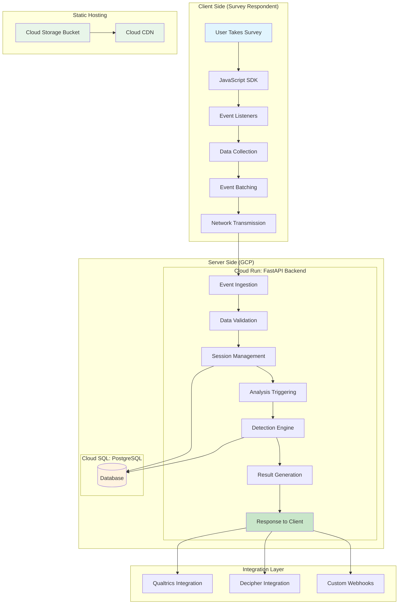
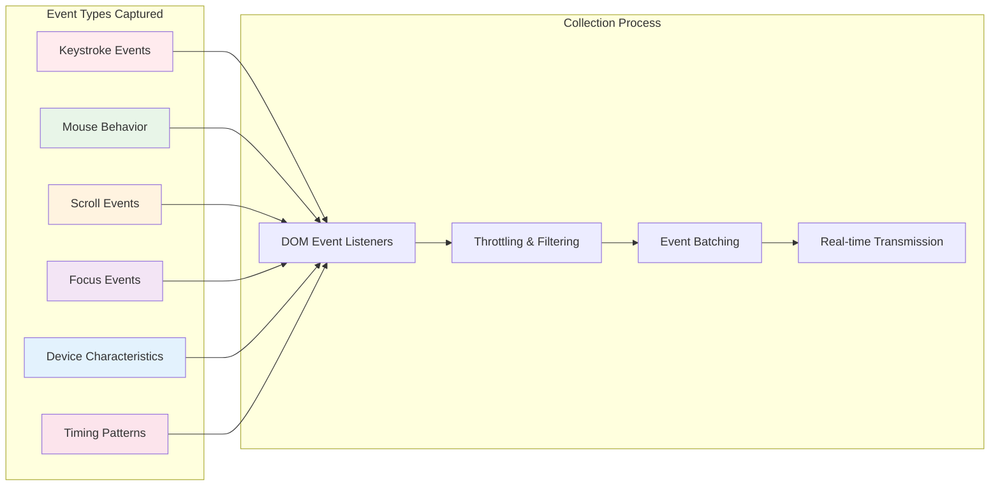
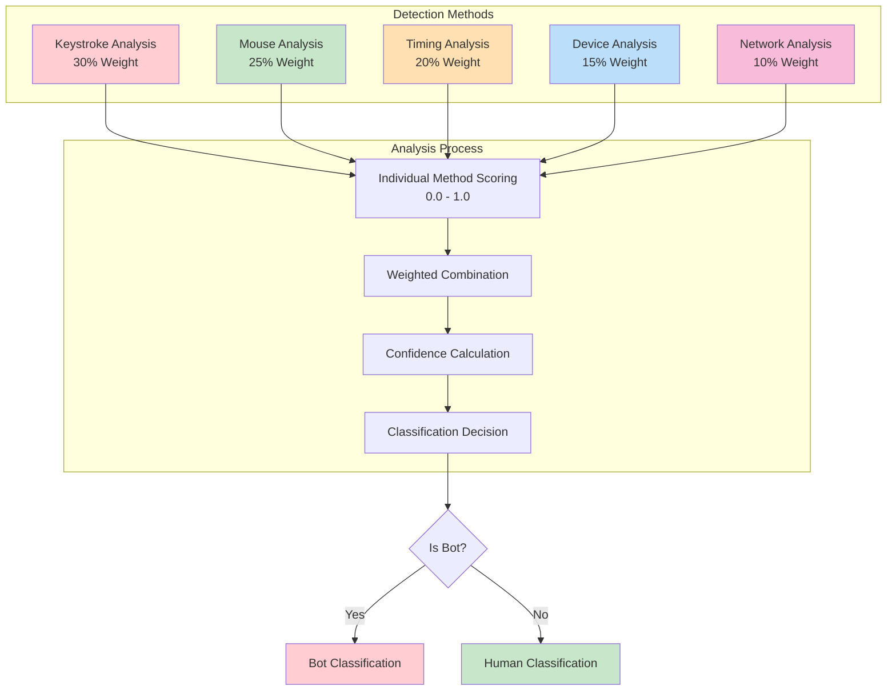
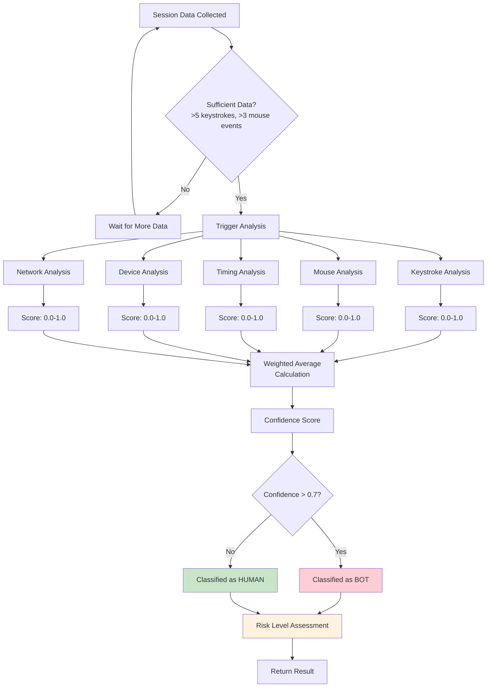
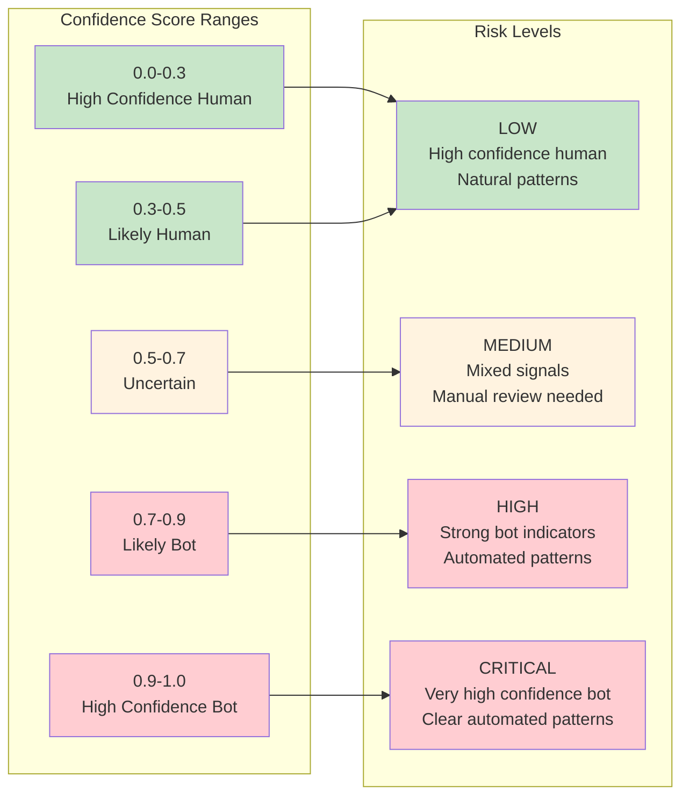
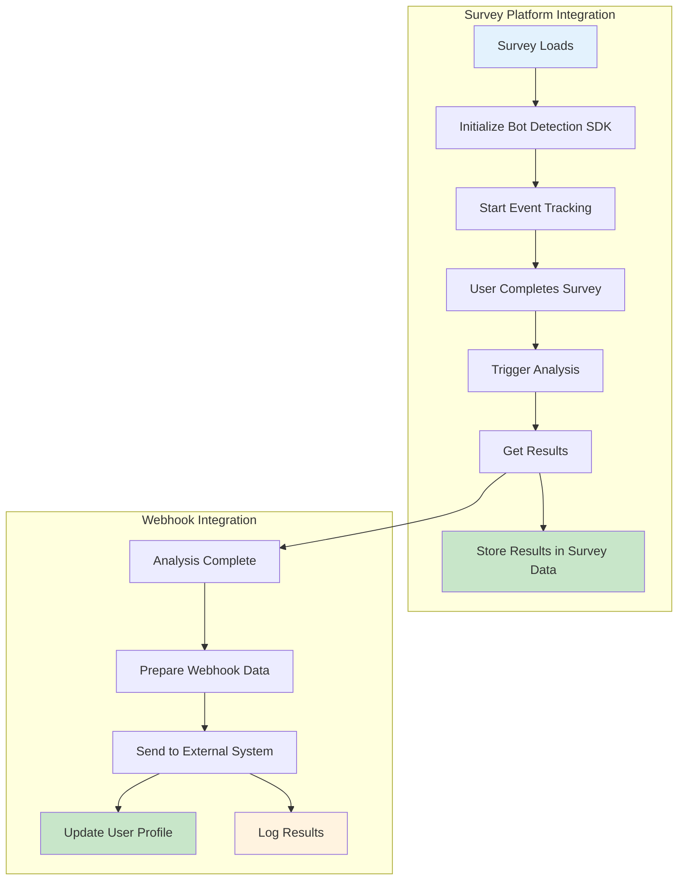
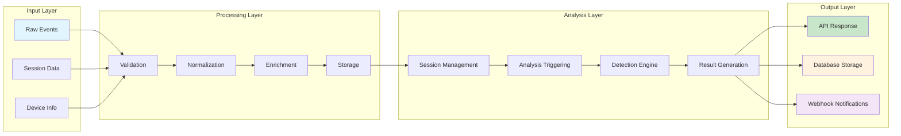

# Bot Detection Methodology - Mermaid Diagrams

## 1. Overall System Architecture

## 2. Data Collection Flow

## 3. Detection Methods & Weights

## 4. Decision Making Process

## 5. Confidence Scoring & Risk Levels

## 6. Integration Flow

## 7. Data Processing Pipeline

## 8. Bot vs Human Indicators

```mermaid
graph TB
    subgraph "Bot Indicators"
        A1[Too Regular Timing<br/>std dev < 10ms]
        A2[Too Fast/Slow<br/>< 50ms or > 2000ms]
        A3[Perfect Precision<br/>> 99% accuracy]
        A4[Straight-line Movements]
        A5[Consistent Patterns]
        A6[Common Bot Screen Sizes]
    end
    
    subgraph "Human Indicators"
        B1[Natural Variation<br/>std dev > 10ms]
        B2[Realistic Timing<br/>50-2000ms intervals]
        B3[Variable Precision<br/>< 99% accuracy]
        B4[Curved Movements]
        B5[Irregular Patterns]
        B6[Unique Device Characteristics]
    end
    
    subgraph "Analysis Methods"
        C1[Keystroke Analysis]
        C2[Mouse Analysis]
        C3[Timing Analysis]
        C4[Device Analysis]
        C5[Network Analysis]
    end
    
    A1 --> C1
    A2 --> C1
    A3 --> C2
    A4 --> C2
    A5 --> C3
    A6 --> C4
    
    B1 --> C1
    B2 --> C1
    B3 --> C2
    B4 --> C2
    B5 --> C3
    B6 --> C4
    
    style A1 fill:#ffcdd2
    style A2 fill:#ffcdd2
    style A3 fill:#ffcdd2
    style A4 fill:#ffcdd2
    style A5 fill:#ffcdd2
    style A6 fill:#ffcdd2
    style B1 fill:#c8e6c9
    style B2 fill:#c8e6c9
    style B3 fill:#c8e6c9
    style B4 fill:#c8e6c9
    style B5 fill:#c8e6c9
    style B6 fill:#c8e6c9
``` 

