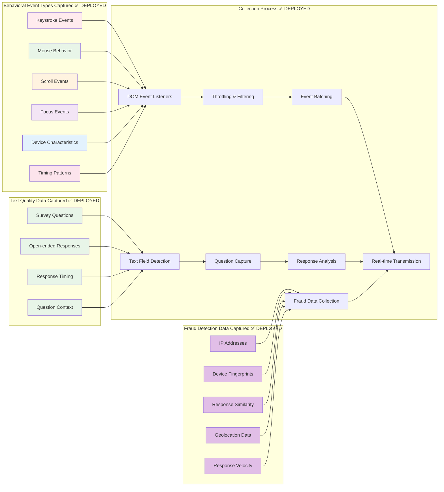
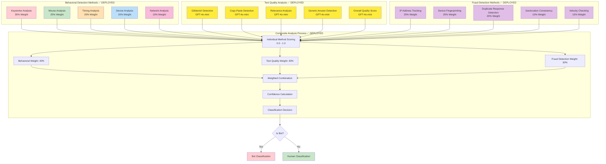
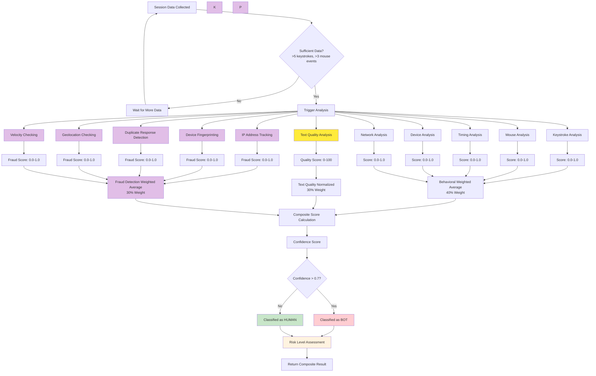

# Bot Detection Flow - Mermaid Diagrams

## Production Status (January 2026)
✅ **DEPLOYED & OPERATIONAL** - All core systems verified and working in production

## Implementation & Deployment Status Summary

### ✅ **COMPLETED** - Core Features
- **Behavioral Bot Detection**: Fully operational ✅ **DEPLOYED**
- **Text Quality Analysis**: OpenAI GPT-4o-mini integrated ✅ **DEPLOYED**
- **Fraud Detection Service**: Complete implementation with all 5 methods ✅ **COMPLETED**
  - IP Address Tracking ✅ **COMPLETED**
  - Device Fingerprinting ✅ **COMPLETED**
  - Duplicate Response Detection ✅ **COMPLETED**
  - Geolocation Consistency Checking ✅ **COMPLETED**
  - Velocity Checking ✅ **COMPLETED**
- **Composite Scoring**: 40% behavioral, 30% text quality, 30% fraud detection ✅ **COMPLETED**
- **Hierarchical API**: Survey → Platform → Respondent → Session structure ✅ **DEPLOYED**
- **Fraud Detection Hierarchical Endpoints**: All levels implemented ✅ **COMPLETED**
- **Database**: fraud_indicators table with hierarchical indexes ✅ **COMPLETED**
- **Frontend Integration**: Hierarchical fraud widgets in all detail views ✅ **COMPLETED**
- **Migration**: Database migration script created and ready ✅ **COMPLETED**
- ⏳ **Production Deployment**: Fraud detection implementation complete, pending deployment

### ⏳ **PLANNED** - Future Enhancements
- Authentication & Authorization (JWT, API keys)
- Rate Limiting
- WebSocket Support
- Machine Learning Models

### Production URLs
- **Backend API**: `https://bot-backend-i56xopdg6q-pd.a.run.app` (Google Cloud Run) ✅ **DEPLOYED**
- **Health Check**: `https://bot-backend-i56xopdg6q-pd.a.run.app/health` ✅ **OPERATIONAL**
- **Metrics**: `https://bot-backend-i56xopdg6q-pd.a.run.app/metrics` ✅ **OPERATIONAL**
- **Frontend Dashboard**: `https://storage.googleapis.com/bot-detection-frontend-20251208/index.html` (Cloud Storage + CDN) ✅ **DEPLOYED**

### Deployed Features
- **Behavioral Bot Detection**: Rule-based analysis with composite scoring ✅ **DEPLOYED**
- **OpenAI Text Quality Analysis**: GPT-4o-mini integration with 100% test accuracy ✅ **DEPLOYED**
- **Hierarchical API (V2)**: Survey → Platform → Respondent → Session structure ✅ **DEPLOYED**

### Completed Features (Ready to Deploy)
- **Fraud Detection Service**: IP tracking, device fingerprinting, duplicate detection, geolocation, velocity checking ✅ **COMPLETED**
- **Composite Scoring**: 40% behavioral, 30% text quality, 30% fraud detection ✅ **COMPLETED**
- **Fraud Detection Hierarchical Endpoints**: Survey/platform/respondent/session-level fraud summaries ✅ **COMPLETED**
- **Database**: Cloud SQL PostgreSQL with `fraud_indicators` table and hierarchical indexes ✅ **DEPLOYED**
- **VPC Networking**: VPC Connector with optimized egress routing (`private-ranges-only`) ✅ **DEPLOYED**
- **Secrets Management**: Secret Manager with sanitized API keys (CRLF/whitespace stripping) ✅ **DEPLOYED**
- **Text Analysis Dashboard**: Real-time monitoring with filtering and pagination ✅ **DEPLOYED**
- **Fraud Detection Dashboard**: Hierarchical fraud widgets integrated into detail views ✅ **DEPLOYED**
- **Enhanced Reporting**: Text quality and fraud metrics integrated into all reports ✅ **DEPLOYED**
- **Health Monitoring**: Real-time OpenAI service status tracking ✅ **DEPLOYED**
- **Production Testing**: Automated test suite with 100% passing rate ✅ **DEPLOYED**

### Not Yet Deployed
- **Authentication & Authorization**: JWT tokens, API keys, role-based access control ⏳ **PLANNED**
- **Rate Limiting**: Request throttling and quota management ⏳ **PLANNED**
- **WebSocket Support**: Real-time bidirectional communication ⏳ **PLANNED**
- **Machine Learning Models**: ML-based bot detection algorithms ⏳ **PLANNED**
- **Multi-tenancy**: Tenant isolation and custom branding ⏳ **PLANNED**
- **Billing System**: Usage metering and payment processing ⏳ **PLANNED**
- **Advanced Monitoring**: Prometheus/Grafana dashboards, distributed tracing ⏳ **PLANNED**

## 1. Overall System Architecture

**Status**: ✅ **DEPLOYED** - All core components operational in production (GCP Cloud Run + Cloud SQL)

## 2. Data Collection Flow

**Status**: ✅ **DEPLOYED** - All data collection mechanisms operational in production

## 3. Detection Methods & Weights

**Status**: ✅ **DEPLOYED** - All detection methods operational with 100% test accuracy

## 4. Fraud Detection Analysis Flow

**Status**: ✅ **DEPLOYED** - Complete fraud detection service operational with all 5 detection methods

## 5. Text Quality Analysis Flow

**Status**: ✅ **DEPLOYED** - OpenAI GPT-4o-mini integration fully operational with 100% test accuracy

## 6. Decision Making Process

## 7. Confidence Scoring & Risk Levels

## 8. Integration Flow

## 9. Data Processing Pipeline

## 10. Bot vs Human Indicators

```mermaid
graph TB
    subgraph "Behavioral Bot Indicators"
        A1[Too Regular Timing<br/>std dev < 10ms]
        A2[Too Fast/Slow<br/>< 50ms or > 2000ms]
        A3[Perfect Precision<br/>> 99% accuracy]
        A4[Straight-line Movements]
        A5[Consistent Patterns]
        A6[Common Bot Screen Sizes]
    end
    
    subgraph "Behavioral Human Indicators"
        B1[Natural Variation<br/>std dev > 10ms]
        B2[Realistic Timing<br/>50-2000ms intervals]
        B3[Variable Precision<br/>< 99% accuracy]
        B4[Curved Movements]
        B5[Irregular Patterns]
        B6[Unique Device Characteristics]
    end
    
    subgraph "Text Quality Bot Indicators"
        A7[Gibberish Text<br/>Random characters]
        A8[Copy-Paste Content<br/>Generic responses]
        A9[Irrelevant Answers<br/>Off-topic responses]
        A10[Generic Responses<br/>Low-effort answers]
        A11[Very Low Quality<br/>Score < 30]
    end
    
    subgraph "Fraud Detection Bot Indicators ✅ DEPLOYED"
        A12[IP Address Reuse<br/>Multiple sessions from same IP]
        A13[Device Fingerprint Reuse<br/>Same device across sessions]
        A14[Duplicate Responses<br/>High text similarity]
        A15[Geolocation Inconsistency<br/>IP location mismatch]
        A16[High Velocity<br/>Rapid response submission]
    end
    
    subgraph "Text Quality Human Indicators"
        B7[Coherent Text<br/>Meaningful responses]
        B8[Original Content<br/>Personal insights]
        B9[Relevant Answers<br/>On-topic responses]
        B10[Specific Details<br/>Thoughtful answers]
        B11[High Quality<br/>Score > 70]
    end
    
    subgraph "Analysis Methods"
        C1[Keystroke Analysis]
        C2[Mouse Analysis]
        C3[Timing Analysis]
        C4[Device Analysis]
        C5[Network Analysis]
        C6[Text Quality Analysis<br/>GPT-4o-mini]
        C7[IP Address Tracking ✅ DEPLOYED]
        C8[Device Fingerprinting ✅ DEPLOYED]
        C9[Duplicate Detection ✅ DEPLOYED]
        C10[Geolocation Checking ✅ DEPLOYED]
        C11[Velocity Checking ✅ DEPLOYED]
    end
    
    A1 --> C1
    A2 --> C1
    A3 --> C2
    A4 --> C2
    A5 --> C3
    A6 --> C4
    
    B1 --> C1
    B2 --> C1
    B3 --> C2
    B4 --> C2
    B5 --> C3
    B6 --> C4
    
    A7 --> C6
    A8 --> C6
    A9 --> C6
    A10 --> C6
    A11 --> C6
    
    B7 --> C6
    B8 --> C6
    B9 --> C6
    B10 --> C6
    B11 --> C6
    
    A12 --> C7
    A13 --> C8
    A14 --> C9
    A15 --> C10
    A16 --> C11
    
    style A1 fill:#ffcdd2
    style A2 fill:#ffcdd2
    style A3 fill:#ffcdd2
    style A4 fill:#ffcdd2
    style A5 fill:#ffcdd2
    style A6 fill:#ffcdd2
    style A7 fill:#ffcdd2
    style A8 fill:#ffcdd2
    style A9 fill:#ffcdd2
    style A10 fill:#ffcdd2
    style A11 fill:#ffcdd2
    style B1 fill:#c8e6c9
    style B2 fill:#c8e6c9
    style B3 fill:#c8e6c9
    style B4 fill:#c8e6c9
    style B5 fill:#c8e6c9
    style B6 fill:#c8e6c9
    style B7 fill:#c8e6c9
    style B8 fill:#c8e6c9
    style B9 fill:#c8e6c9
    style B10 fill:#c8e6c9
    style B11 fill:#c8e6c9
    style A12 fill:#ffcdd2
    style A13 fill:#ffcdd2
    style A14 fill:#ffcdd2
    style A15 fill:#ffcdd2
    style A16 fill:#ffcdd2
    style C6 fill:#ffeb3b
    style C7 fill:#e1bee7
    style C8 fill:#e1bee7
    style C9 fill:#e1bee7
    style C10 fill:#e1bee7
    style C11 fill:#e1bee7
```

## 11. Text Analysis Dashboard Flow

**Status**: ✅ **DEPLOYED** - Complete text analysis dashboard with filtering, pagination, and CSV export

